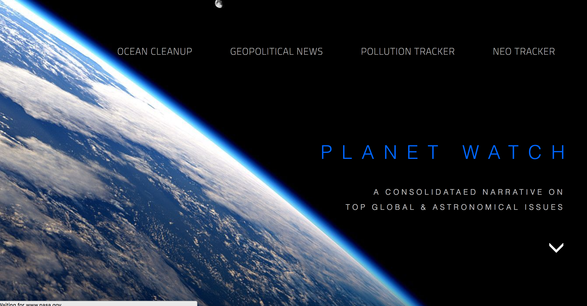
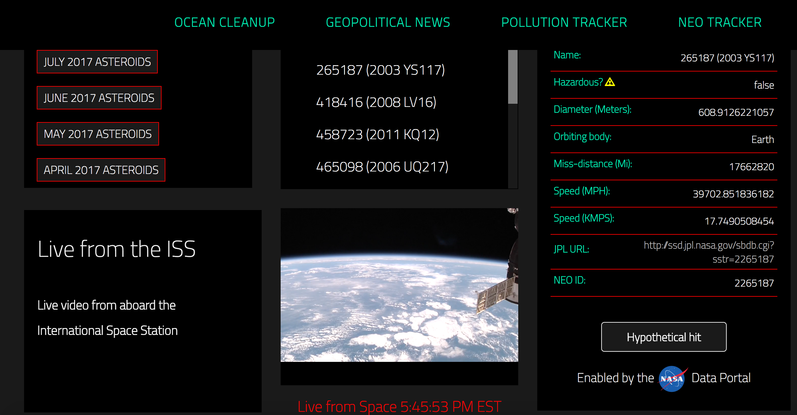
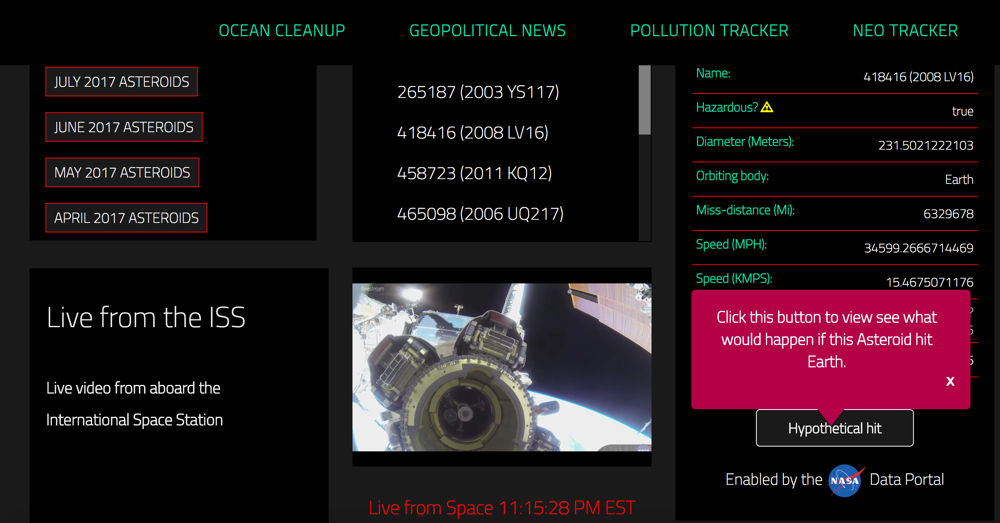
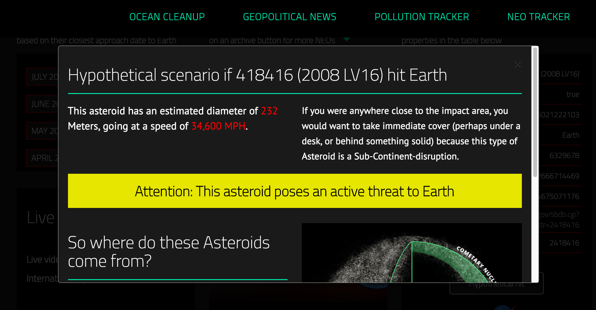

# Welcome to Planet Watch

### To run, please clone this repo, cd into it and run `npm start`

### What is Planet Watch?

Planet Watch is an educational app that consolidates various global topics and simplifies the data that persists elsewhere on the internet. Instead of having to read pages upon pages of articles, Planet Watch provides an interactive style of learning- filled with visuals and hands-on learning. 

### What features does Planet Watch contain that will enhance my learning?

- **An NEO Tracker (Near Earth Object Tracker)**, which has information about Asteroids that are currently orbiting Earth. The information provided will help you understand where these asteroids come from, how fast they are travelling and the effects (with advice) if they potentially will hit Earth. All this information is derived from the NASA open APIs data portal, which Planet Watch simplifies for you to comprehend in English.

### NEO Tracker gallery:

## 'Hypothetical Hit' Modal click view:

